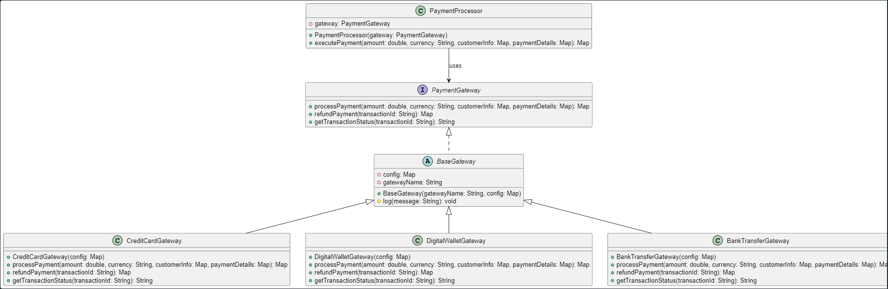

# SE-Lab---HW2

# در مرحله اول، مراحل اصلی پروژه را(که شامل ۴ بخش کلی به همراه ریزجزئیات می‌باشند) شرح می‌دهیم و بورد کانبان را به منظور پیشبرد اهداف پروه برای اعضای تیم، طراحی می‌کنیم:

    مرحله ۱: تحلیل و شناسایی Code Smell
    مرحله ۲: بازآرایی برای کپسوله‌سازی و انتزاع
    مرحله ۳: معرفی وراثت و چندریختی از طریق رابط PaymentGateway
    مرحله ۴: بازآرایی پیشرفته و یکپارچه‌سازی (dependency injection و مدیریت پیکربندی)

---

# سیستم پرداخت - مرحله ۳: وراثت و چندریختی با رابط PaymentGateway

این مستند توضیحاتی درباره تغییرات و بهبودهای اعمال‌شده در **مرحله ۳** پروژه سیستم پرداخت را ارائه می‌دهد. در این مرحله هدف اصلی جداسازی یکپارچه‌سازی درگاه‌های پرداخت از منطق اصلی پرداخت با استفاده از اصول وراثت و چندریختی (Polymorphism) بوده است.

---

## اهداف مرحله ۳

- **تعریف رابط PaymentGateway:**  
  ایجاد یک رابط (Interface) جهت تعریف متدهای اصلی مورد نیاز برای پردازش پرداخت، بازپرداخت و دریافت وضعیت تراکنش.

- **به اشتراک‌گذاری منطق مشترک:**  
  طراحی یک کلاس انتزاعی به نام **BaseGateway** جهت استفاده از منطق‌های مشترک مانند ثبت گزارش (Logging) و نگهداری پیکربندی.

- **پیاده‌سازی درگاه‌های مختلف:**  
  ایجاد حداقل سه پیاده‌سازی برای درگاه‌های پرداخت متفاوت شامل:

  - **CreditCardGateway** برای پردازش پرداخت با کارت اعتباری
  - **DigitalWalletGateway** برای پرداخت کیف پول دیجیتال
  - **BankTransferGateway** برای انتقال بانکی

- **استفاده از چندریختی در پردازش پرداخت:**  
  تغییر ساختار کلاس **PaymentProcessor** به‌گونه‌ای که از یک شیء از نوع PaymentGateway استفاده کند. این امر امکان تغییر درگاه پرداخت در زمان اجرا را بدون تغییر در منطق اصلی فراهم می‌کند.

---

## ساختار فایل‌ها

برای سازماندهی بهتر پروژه، فایل‌ها به صورت زیر نامگذاری و ذخیره شده‌اند:

- **PaymentGateway.java:**  
  تعریف رابط PaymentGateway شامل متدهای اصلی:

  - `processPayment(...)`
  - `refundPayment(...)`
  - `getTransactionStatus(...)`

- **BaseGateway.java:**  
  کلاس انتزاعی جهت اشتراک‌گذاری منطق‌های مشترک (مانند ثبت گزارش).  
  _توجه:_ در این فایل می‌توان متد log را به‌گونه‌ای بهبود داد که تاریخ و زمان ثبت لاگ را نمایش دهد.

- **CreditCardGateway.java:**  
  پیاده‌سازی درگاه پرداخت کارت اعتباری با استفاده از کلاس BaseGateway.

- **DigitalWalletGateway.java:**  
  پیاده‌سازی درگاه پرداخت کیف پول دیجیتال با استفاده از کلاس BaseGateway.

- **BankTransferGateway.java:**  
  پیاده‌سازی درگاه انتقال بانکی با استفاده از کلاس BaseGateway.

- **PaymentProcessor.java:**  
  کلاس پردازش پرداخت که به جای استفاده از switch-case، از یک شیء از نوع PaymentGateway استفاده می‌کند. این تغییر امکان استفاده از چندریختی را فراهم می‌کند.

---

## نحوه عملکرد و استفاده

1. **تنظیم پیکربندی:**  
   فایل‌های درگاه‌ها از یک Map پیکربندی استفاده می‌کنند که شامل URLهای API مربوط به هر درگاه می‌باشد.

2. **پردازش پرداخت:**

   - ابتدا یک شیء از یکی از پیاده‌سازی‌های PaymentGateway (مثلاً CreditCardGateway) ساخته می‌شود.
   - سپس شیء PaymentProcessor با دریافت شیء PaymentGateway ساخته شده، عملیات پرداخت را انجام می‌دهد.
   - در صورت نیاز، می‌توان به سادگی درگاه پرداخت را با یک شیء دیگر (مثلاً DigitalWalletGateway) جایگزین کرد تا عملکرد چندریختی به نمایش گذاشته شود.

3. **ثبت گزارش:**  
   هر پیاده‌سازی درگاه از متد `log` موجود در BaseGateway برای ثبت گزارش با نام درگاه (و در صورت تمایل با تاریخ و زمان) استفاده می‌کند.

4. **تست و اعتبارسنجی:**  
   اجرای کلاس Main نمونه‌ای از تغییر درگاه‌های پرداخت را در زمان اجرا نشان می‌دهد. این کلاس نمونه‌هایی از پرداخت با کارت اعتباری و کیف پول دیجیتال را نمایش می‌دهد.

5. **دیاگرام کلاس ها:**
   برای مشاهدۀ دیاگرام کلاس ها کافیست در vscode فایل ClassDiagram.puml را باز کرده و به کمک اکستنشن PlantUML این کد را اجرا کنید. خروجی مشابه تصویر زیر خواهد بود:
   

---

## نکات تکمیلی

- **مستندسازی:**  
  در تمامی کلاس‌ها و متدها از توضیحات (Javadoc) استفاده شده است تا عملکرد هر بخش به وضوح مشخص شود.

- **قابلیت توسعه:**  
  با استفاده از رابط PaymentGateway و کلاس BaseGateway، افزودن درگاه‌های جدید بسیار ساده خواهد بود؛ تنها کافی است یک کلاس جدید پیاده‌سازی شده از PaymentGateway (یا با استفاده از BaseGateway) ایجاد شود.

- **اصول طراحی:**  
  این تغییرات کمک می‌کنند تا سیستم از اصول SOLID بهره‌مند شود، به ویژه اصل باز/بسته و اصل تک مسئولیتی.

- **نقطه کنترل:**  
  تغییرات مربوط به مرحله ۳ در شاخه‌ای به نام `stage3-gateway` کامیت شده اند.
